# Gift Shop

## Deployment

- Checkout deployment at <https://gagandeep39.github.io/gift-shop-monolithic/>

## Screenshots

### Auth

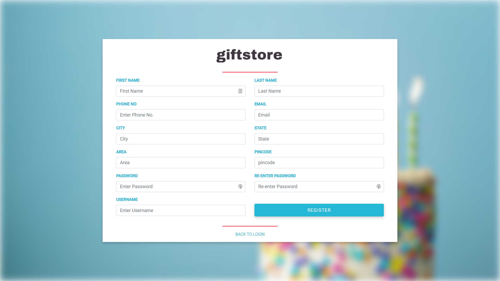
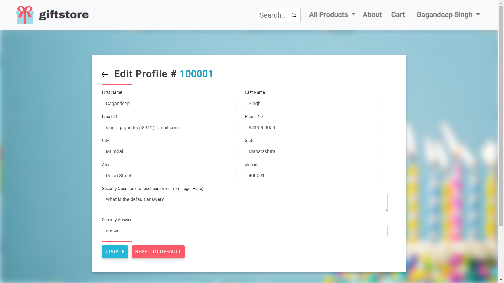

### Home

### Cart

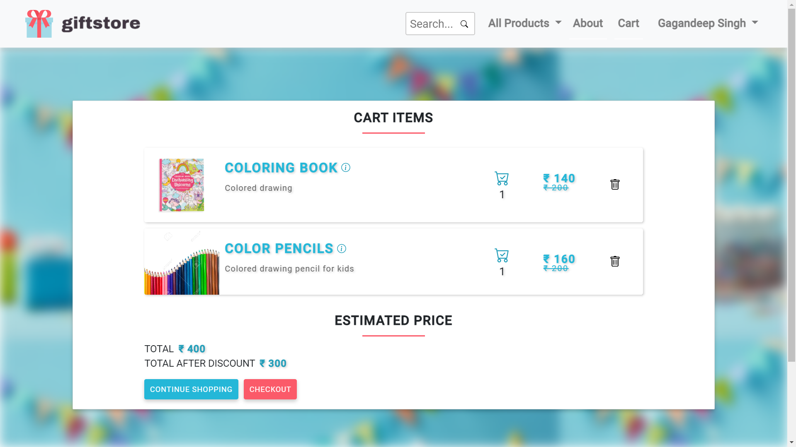
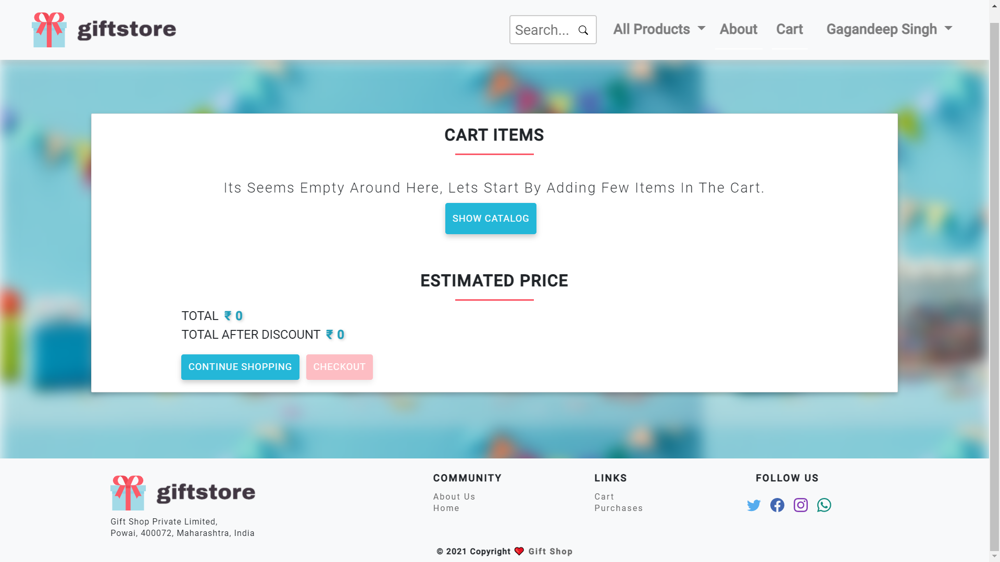
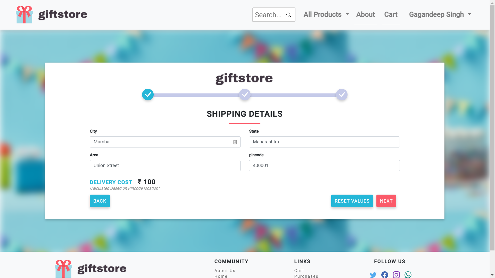

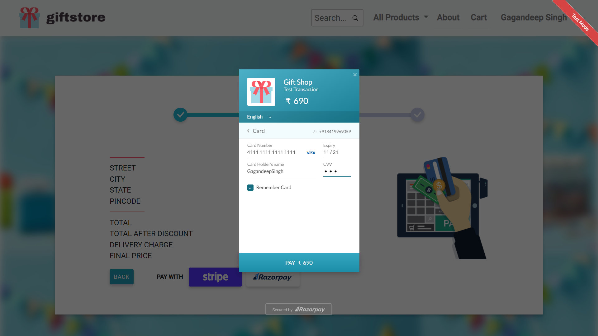
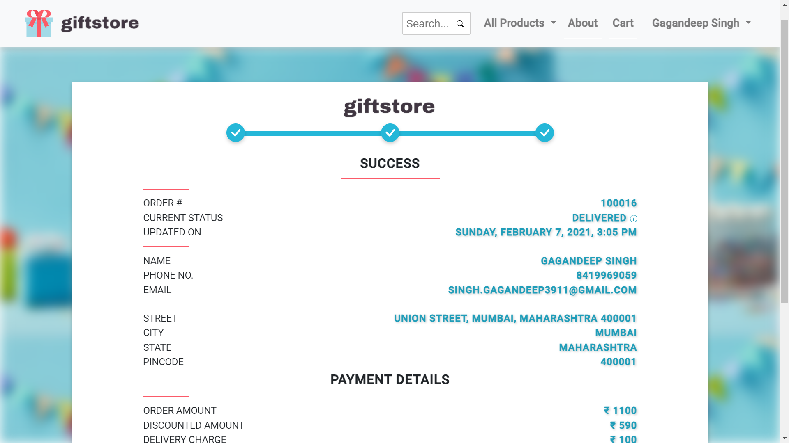

### Orders

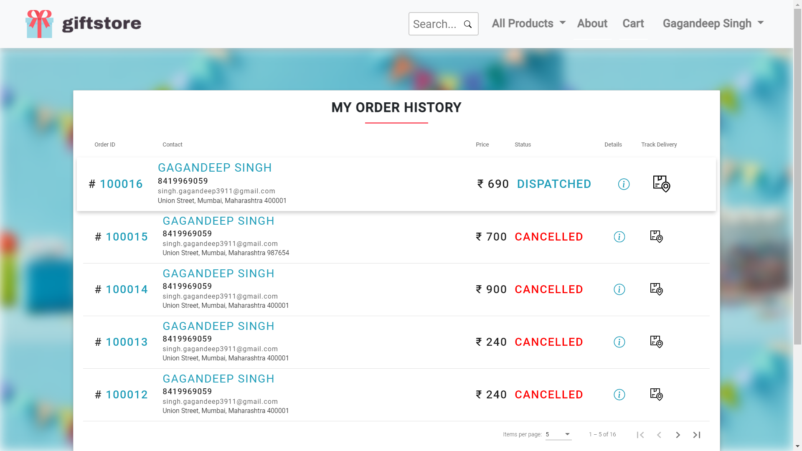
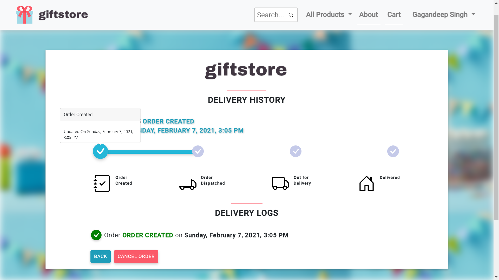

### Admin

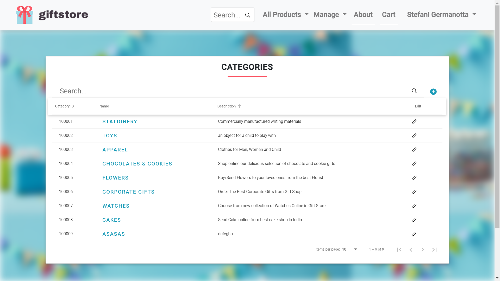
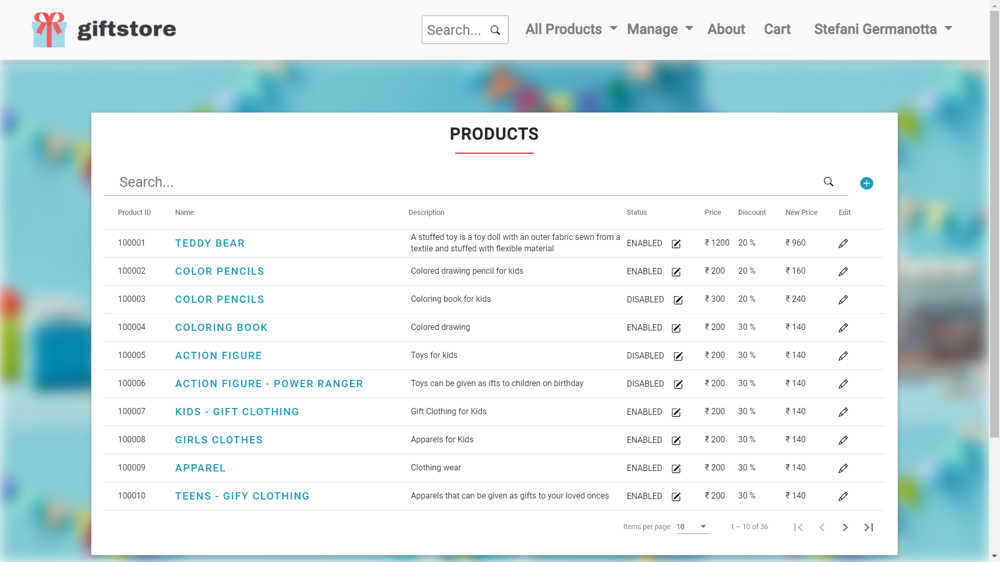

## Microservice Code

- Refer link for Microservice Architecture <https://github.com/Gagandeep39/gift-shop/>

## GH Pages Issue

- Use '^' before images in CSS file
- Use 'assets/path' for HTML (Do not add / befor assets)

## Payment

- Razor Pay
  - Card - 4111 1111 1111 1111
  - CVV - Any 3 digit number
  - Date - Any Future Date
- Stripe
  - Card - 4242 4242 4242 4242
  - CVV - Any 3 digit number
  - Date - Any Future Date
